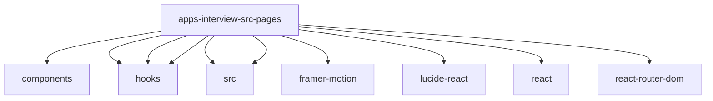

# Imports

[← Back to MODULE](MODULE.md) | [← Back to INDEX](../../INDEX.md)

## Dependency Graph

## External Dependencies

Dependencies from other modules:

- `../components/AIAudioVisualizer`
- `../hooks/useAudioPlayer`
- `../hooks/useAudioRecorder`
- `../hooks/useWebSocket`
- `@hireflow/i18n/src/react`
- `@hireflow/utils/src/index`
- `framer-motion`
- `lucide-react`
- `react`
- `react-router-dom`

