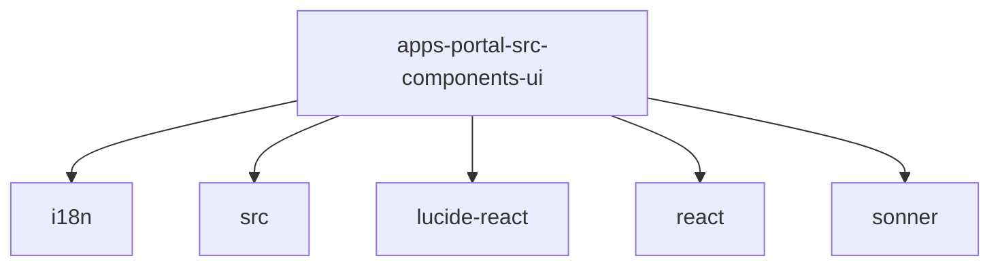

# Imports

[← Back to MODULE](MODULE.md) | [← Back to INDEX](../../INDEX.md)

## Dependency Graph

## External Dependencies

Dependencies from other modules:

- `@hireflow/i18n/react`
- `@hireflow/utils/src/index`
- `lucide-react`
- `react`
- `sonner`

