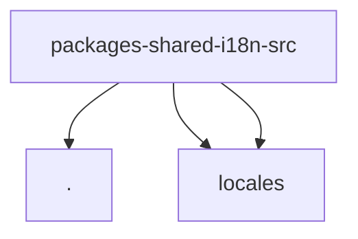

# Module: packages/shared/i18n/src

[← Back to INDEX](../../INDEX.md)

**Type:** js/ts | **Files:** 4

**Entry point:** `packages/shared/i18n/src/index.ts`

## Files

| File | Lines | Large |
| ---- | ----- | ----- |
| `packages/shared/i18n/src/index.ts` | 89 |  |
| `packages/shared/i18n/src/locales/en.ts` | 538 | 📊 |
| `packages/shared/i18n/src/locales/zh.ts` | 546 | 📊 |
| `packages/shared/i18n/src/react.ts` | 70 |  |

---

Symbol maps for 2 large files in this module.

## packages/shared/i18n/src/locales/en.ts (538 lines)

_No symbols extracted._

## packages/shared/i18n/src/locales/zh.ts (546 lines)

_No symbols extracted._
---

## External Dependencies

Dependencies from other modules:

- `./index`
- `./locales/en`
- `./locales/zh`
