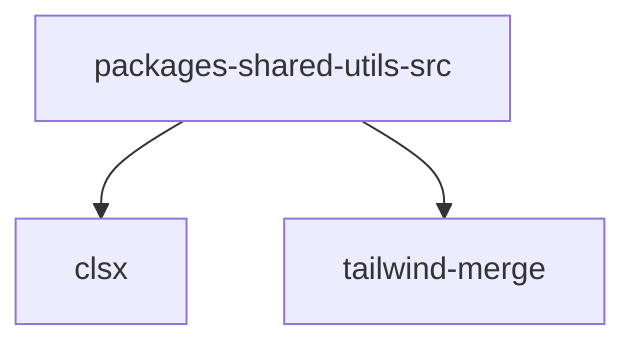

# Module: packages/shared/utils/src

[← Back to INDEX](../../INDEX.md)

**Type:** js/ts | **Files:** 1

**Entry point:** `packages/shared/utils/src/index.ts`

## Files

| File | Lines | Large |
| ---- | ----- | ----- |
| `packages/shared/utils/src/index.ts` | 142 |  |

---

## External Dependencies

Dependencies from other modules:

- `clsx`
- `tailwind-merge`
