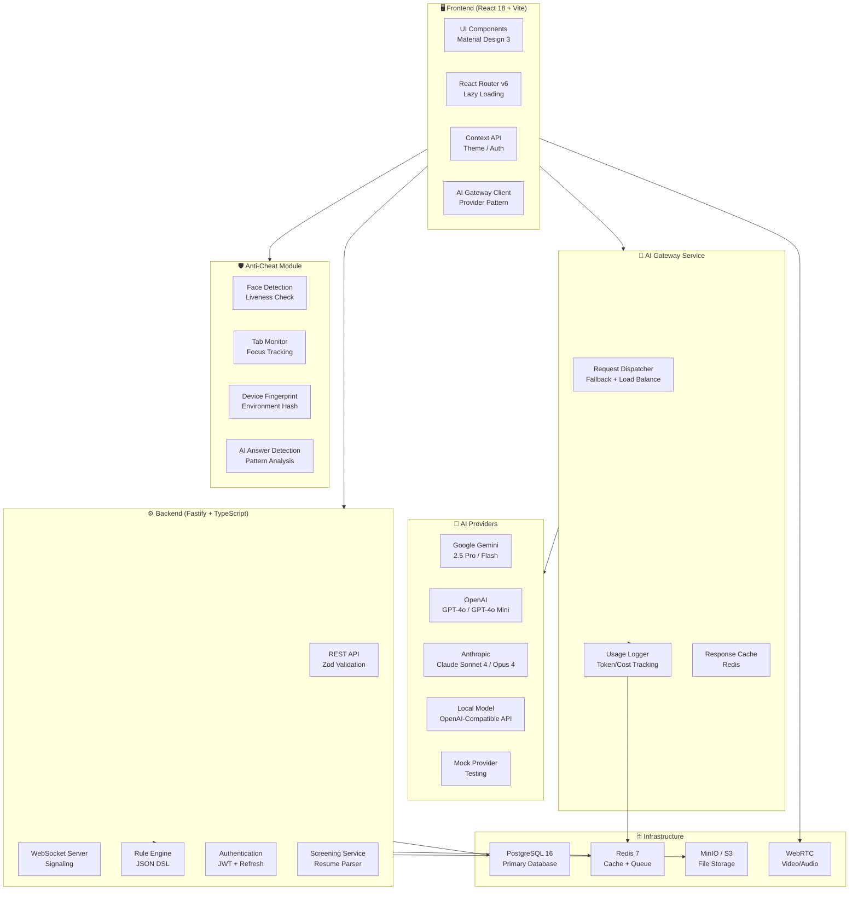
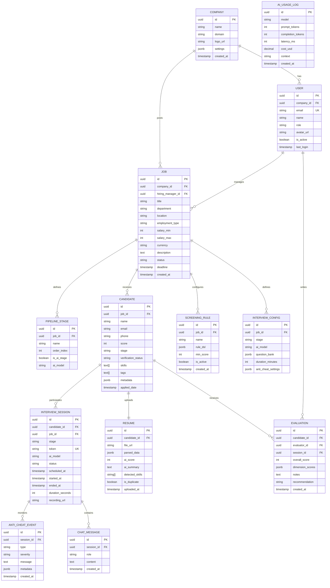

# 🚀 HireFlow AI — Intelligent Recruitment Platform

<div align="center">

**AI-Powered HR Recruitment Platform with Multi-LLM Support**

Automated video interviews • Smart resume screening • Anti-cheat proctoring • Team collaboration

[](https://www.typescriptlang.org/)
[](https://react.dev/)
[](https://vitejs.dev/)
[](https://fastify.dev/)
[](https://www.docker.com/)

</div>

---

## 📋 Table of Contents

- [Architecture Overview](#-architecture-overview)
- [Database Design](#-database-design)
- [Project Structure](#-project-structure)
- [Tech Stack](#-tech-stack)
- [Features](#-features)
- [Quick Start](#-quick-start)
- [Docker Deployment](#-docker-deployment)
- [Configuration](#-configuration)
- [API Documentation](#-api-documentation)
- [AI Provider Setup](#-ai-provider-setup)
- [Security](#-security)

---

## 🏗 Architecture Overview



---

## 💾 Database Design



---

## 📁 Project Structure

```
hireflow/
├── 📄 index.html                    # Entry HTML (Vite)
├── 📄 package.json                  # Dependencies & scripts
├── 📄 vite.config.ts                # Vite + Tailwind + Proxy config
├── 📄 tsconfig.json                 # TypeScript configuration
├── 📄 docker-compose.yml            # Full dev environment
├── 📄 Dockerfile                    # Multi-stage production build
├── 📄 .env.example                  # Environment variables template
│
├── 📁 src/                          # Frontend source
│   ├── 📄 main.tsx                  # App entry point
│   ├── 📄 App.tsx                   # Root component + routing
│   ├── 📄 index.css                 # Design system (M3 tokens)
│   │
│   ├── 📁 components/
│   │   └── 📁 layout/
│   │       └── 📄 Layout.tsx        # Sidebar + Header + Page shell
│   │
│   ├── 📁 pages/
│   │   ├── 📄 Dashboard.tsx         # KPI cards, funnel, charts, table
│   │   ├── 📄 CandidatesPage.tsx    # Kanban + list view + comparison
│   │   ├── 📄 JobsPage.tsx          # Job openings management
│   │   ├── 📄 InterviewRoomPage.tsx # AI video interview room
│   │   ├── 📄 InterviewLinkPage.tsx # Candidate device check + entry
│   │   ├── 📄 RuleEditorPage.tsx    # Visual screening rule builder
│   │   └── 📄 SettingsPage.tsx      # AI models, security, integrations
│   │
│   ├── 📁 services/
│   │   ├── 📁 ai/
│   │   │   └── 📄 aiGateway.ts      # Multi-LLM gateway with fallback
│   │   └── 📁 rules/
│   │       └── 📄 ruleEngine.ts     # JSON DSL rule evaluation engine
│   │
│   ├── 📁 contexts/
│   │   └── 📄 ThemeContext.tsx       # Dark/Light theme management
│   │
│   ├── 📁 data/
│   │   └── 📄 mockData.ts           # Development mock data
│   │
│   ├── 📁 lib/
│   │   └── 📄 utils.ts              # Shared utility functions
│   │
│   └── 📁 types/
│       └── 📄 index.ts              # TypeScript type definitions
│
└── 📁 server/                       # Backend source
    ├── 📄 index.ts                  # Fastify API server
    └── 📄 tsconfig.json             # Server TypeScript config
```

---

## 🛠 Tech Stack

| Layer | Technology | Purpose |
|-------|-----------|---------|
| **Frontend** | React 18, TypeScript, Vite 6 | SPA framework |
| **Styling** | Tailwind CSS v4, Framer Motion | Design system + animations |
| **Charts** | Recharts | Dashboard visualizations |
| **Icons** | Lucide React | Consistent iconography |
| **Routing** | React Router v6 | Client-side routing |
| **Backend** | Fastify + TypeScript | REST API server |
| **Validation** | Zod | Schema validation |
| **Database** | PostgreSQL 16 | Primary data store |
| **Cache** | Redis 7 | Sessions, cache, queue |
| **Storage** | MinIO (S3-compat) | File/video storage |
| **Real-time** | WebSocket + WebRTC | Video interviews |
| **AI** | Gemini, OpenAI, Claude | Multi-LLM support |
| **Container** | Docker Compose | Development environment |

---

## ✨ Features

### 🎯 Candidate Portal
- **Unique interview links** with expiration and single-use validation
- **Device pre-check** (camera, microphone, network quality)
- **AI video interview** with real-time chat and code editor
- **Anti-cheat monitoring** (tab switching, liveness, face detection)

### 📊 Enterprise Dashboard
- **Recruitment funnel** visualization with conversion rates
- **KPI cards** with trend indicators
- **Activity trends** chart (applications, interviews, offers)
- **Candidate Kanban board** with drag-and-drop
- **Radar chart comparison** for side-by-side candidate evaluation

### 🧠 AI-Powered Screening
- **Visual rule builder** with nested AND/OR/NOT logic
- **12+ operators** (EQUALS, GTE, CONTAINS, REGEX, BETWEEN, etc.)
- **Rule templates** for common roles
- **Match score calculation** with per-rule weighting
- **Test against sample data** before deploying

### ⚙️ Administration
- **Multi-model AI configuration** (8 models across 4 providers)
- **Temperature & token tuning** with visual sliders
- **API key management** with encryption status
- **Security toggles** (AES-256, anti-cheat, GDPR, data retention)
- **Integration directory** (Calendar, ATS, Messenger, Webhook)

---

## 🚀 Quick Start

### Prerequisites

- **Node.js** ≥ 20
- **npm** ≥ 10
- **Docker** (optional, for full stack)

### 1. Clone & Install

```bash
git clone https://github.com/your-org/hireflow.git
cd hireflow
npm install
```

### 2. Configure Environment

```bash
cp .env.example .env
# Edit .env and add your API keys
```

### 3. Run Development Server

```bash
# Start frontend (port 3000)
npm run dev

# Start backend (port 4000) - in another terminal
npx tsx --watch server/index.ts
```

### 4. Open Browser

Navigate to **http://localhost:3000**

---

## 🐳 Docker Deployment

Run the entire stack with a single command:

```bash
# Start all services
docker compose up -d

# View logs
docker compose logs -f

# Stop everything
docker compose down
```

**Services:**
| Service | Port | Description |
|---------|------|-------------|
| Frontend | 3000 | Vite dev server |
| API | 4000 | Fastify backend |
| PostgreSQL | 5432 | Primary database |
| Redis | 6379 | Cache & queue |
| MinIO | 9000/9001 | Object storage |

---

## ⚙️ Configuration

### AI Provider Setup

| Provider | Environment Variable | Models |
|----------|---------------------|--------|
| Google Gemini | `GEMINI_API_KEY` | gemini-2.5-pro, gemini-2.5-flash |
| OpenAI | `OPENAI_API_KEY` | gpt-4o, gpt-4o-mini |
| Anthropic | `ANTHROPIC_API_KEY` | claude-sonnet-4, claude-opus-4 |
| Local | `LOCAL_MODEL_URL` | Any OpenAI-compatible API |
| Mock | (none) | Built-in test responses |

The AI Gateway automatically falls back to the next available provider if the primary model fails.

### Anti-Cheat Configuration

The anti-cheat module can be configured per-interview:

```json
{
  "tabMonitoring": true,
  "faceLiveness": true,
  "multiPersonDetection": true,
  "aiAnswerDetection": false,
  "maxViolations": 3
}
```

---

## 📡 API Documentation

### Interview Link API

```
POST   /api/interviews/link          # Generate interview link
GET    /api/interviews/link/:token   # Validate interview link
```

### AI Usage API

```
POST   /api/ai/usage                 # Log AI call
GET    /api/ai/usage                 # Usage statistics
```

### Screening API

```
POST   /api/screening/evaluate       # Evaluate candidate against rules
```

### System

```
GET    /api/health                   # Health check
GET    /api/webrtc/ice-servers       # WebRTC ICE configuration
```

All endpoints return a standardized response:

```json
{
  "success": true,
  "data": { ... },
  "error": null
}
```

---

## 🔐 Security

- **AES-256 encryption** for all stored interview recordings
- **JWT authentication** with refresh token rotation
- **Zod validation** on all API inputs
- **Anti-cheat proctoring** with configurable strictness
- **GDPR / PIPL compliant** data handling options
- **Audit logging** for all sensitive operations
- **Data retention policies** with auto-purge support
- **Device fingerprinting** for interview integrity

---

## 📄 License

MIT License — see [LICENSE](LICENSE) for details.

---

<div align="center">
<b>Built with ❤️ by the HireFlow AI Team</b>
</div>
