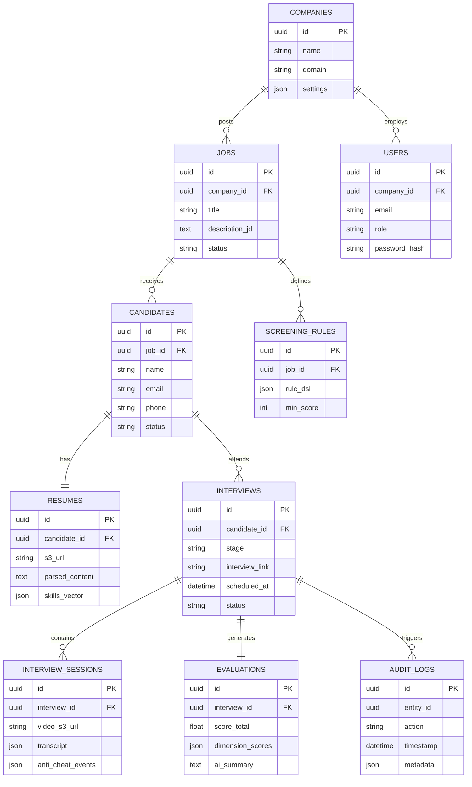

# HireFlow AI

HireFlow AI is a next-generation recruitment platform powered by Multi-LLM orchestration.

## 1. System Architecture

```mermaid
graph TD
    subgraph Client Layer
        Candidate[Candidate Portal]
        Admin[Enterprise Dashboard]
    end

    subgraph API Gateway / Load Balancer
        Gateway[API Gateway (Rate Limit/Auth)]
    end

    subgraph Application Server
        Auth[Auth Service]
        Interview[Interview Engine]
        Recruitment[Recruitment Core]
        Signaling[WebRTC Signaling]
    end

    subgraph AI Infrastructure
        AI_Gateway[Unified AI Gateway]
        Provider_Mgr[Provider Manager]
        
        Gemini[Google Gemini 2.5]
        OpenAI[OpenAI GPT-4o]
        Claude[Anthropic Claude]
        Local[Local LLM]
    end

    subgraph Data Layer
        Postgres[(PostgreSQL - Structured Data)]
        Redis[(Redis - Cache/Session)]
        S3[(S3 Object Storage - Video/Resumes)]
    end

    Candidate --> Gateway
    Admin --> Gateway
    Gateway --> Auth
    Gateway --> Interview
    Gateway --> Recruitment
    
    Interview <--> Signaling
    Candidate <--> Signaling
    
    Interview --> AI_Gateway
    Recruitment --> AI_Gateway
    
    AI_Gateway --> Provider_Mgr
    Provider_Mgr --> Gemini
    Provider_Mgr --> OpenAI
    Provider_Mgr --> Claude
    
    Application Server --> Postgres
    Application Server --> Redis
    Application Server --> S3
```

## 2. Database ER Diagram



## 3. Directory Structure

```
/
├── index.html
├── index.tsx
├── App.tsx
├── types.ts
├── services/
│   ├── ai/
│   │   ├── aiProvider.ts       # Provider Pattern Implementation
│   │   └── prompts.ts
│   ├── rules/
│   │   └── ruleEngine.ts       # Resume Screening Logic
│   └── webrtc/
│       └── signaling.ts        # Signaling Mock
├── components/
│   ├── Dashboard.tsx           # Enterprise View
│   ├── InterviewRoom.tsx       # Candidate Video View
│   ├── RuleEditor.tsx          # Visual Rule Builder
│   └── AntiCheatMonitor.tsx    # Security Component
└── README.md
```

## 4. Setup Guide

1.  Clone repository.
2.  Install dependencies: `npm install`
3.  Set `API_KEY` in `.env` (for Gemini).
4.  Run `npm start`.
5.  Docker: `docker-compose up` (using the provided yaml).
